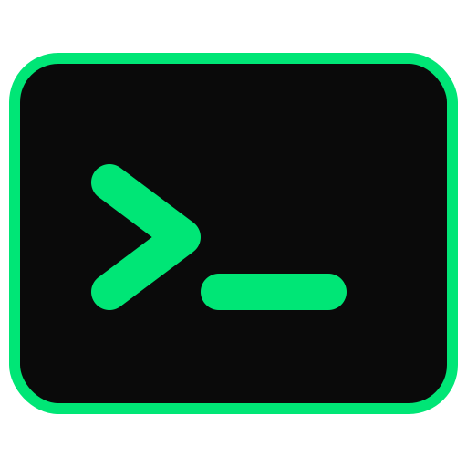
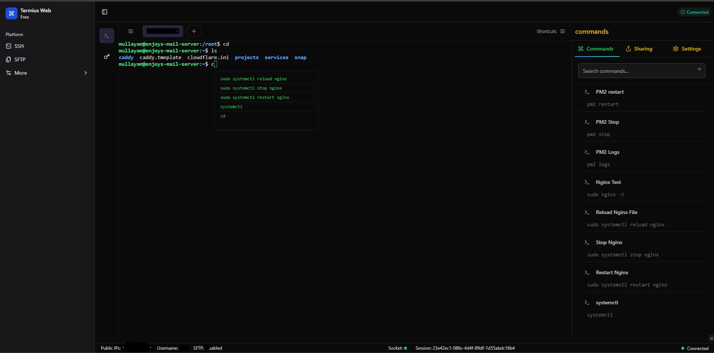
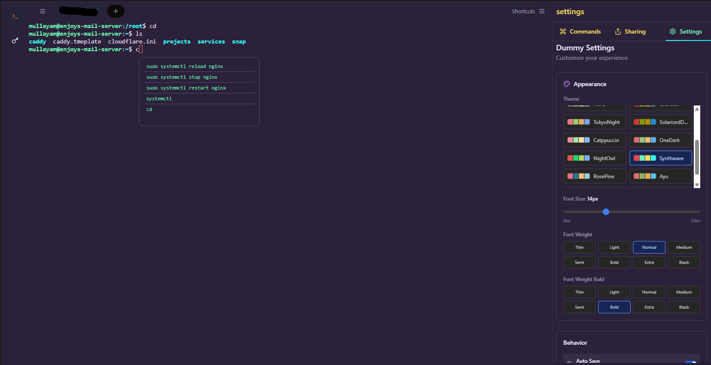
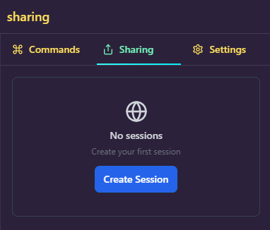
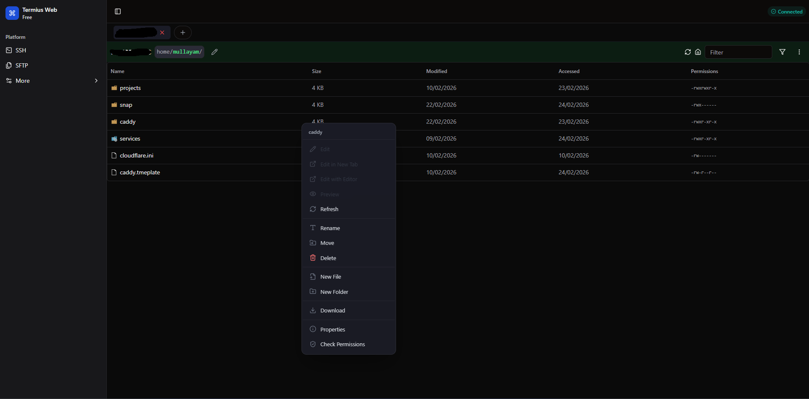
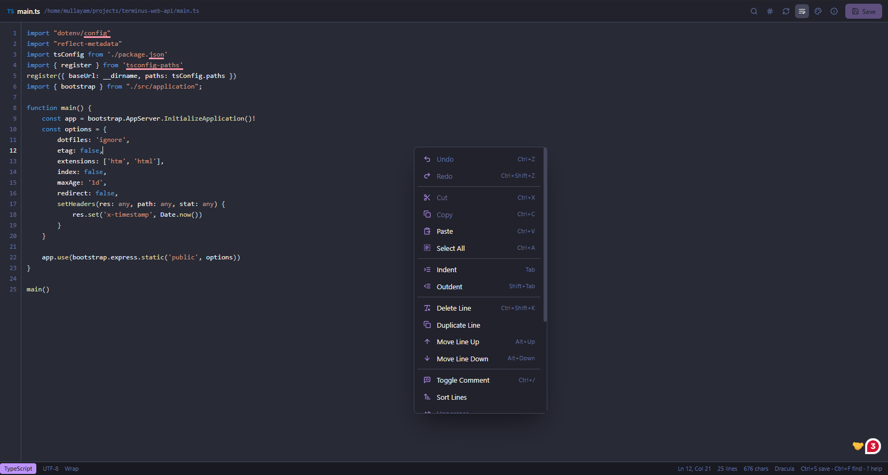
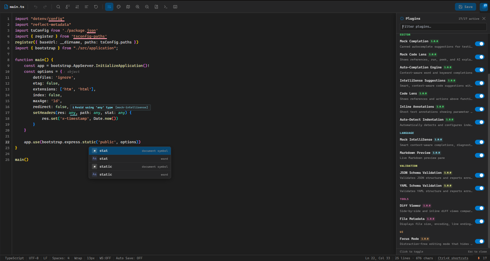
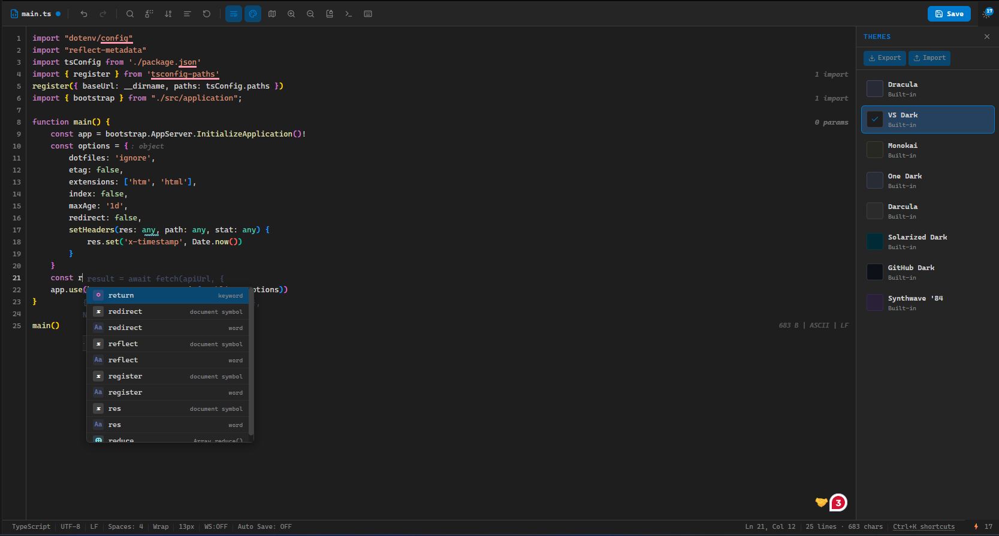
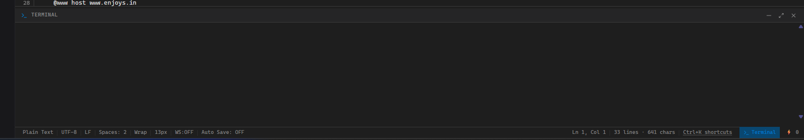

<p align="center">
  
</p>

<h1 align="center">Terminus Web</h1>

<p align="center">
  <strong>The complete browser-based DevOps workspace — SSH terminal, SFTP, code editor, collaborative terminal sharing, and AI assistance.</strong>
</p>

<p align="center">
  <a href="#features">Features</a> •
  <a href="#screenshots">Screenshots</a> •
  <a href="#getting-started">Getting Started</a> •
  <a href="#architecture">Architecture</a> •
  <a href="#contributing">Contributing</a> •
  <a href="#license">License</a>
</p>

---

## Features

### 🖥️ SSH Terminal
- **Web-based xterm.js** with WebGL / Canvas rendering, ligatures, image protocol, clipboard, search, and Unicode 11 support
- **Multi-tab sessions** — open multiple SSH connections side by side
- **Password & private-key authentication** — credentials stored securely in the browser's IndexedDB
- **Per-session themes** — 17+ built-in color themes (Dracula, Nord, Catppuccin, Tokyo Night, …) switchable at runtime
- **Per-session font settings** — size, weight, and bold weight per tab
- **Split terminal** — horizontal and vertical splits
- **Idle auto-reconnect** — reconnects transparently on network interruptions
- **Command palette** — quick-access packs for PM2, Nginx, Docker, Git, and more
- **Diagnostics overlay** — real-time error/warning detection with AI chat for troubleshooting
- **Ghost-text autocomplete** — inline command suggestions from shell history, command packs, and context engine
- **Terminal placeholder hints** — shows tips or random jokes (icanhazdadjoke API) when the prompt is idle

### 🤝 Collaborative Terminal Sharing (NEW)
- **Real-time multi-user terminal** — share a live terminal session with teammates via link
- **Role-based permissions** — `400` (read-only), `700` (write), `777` (admin) per user
- **Automatic PTY locking** — prevents input conflicts; buffers input client-side while locked
- **Admin panel** — lock/unlock terminal, change permissions, kick or block users, unblock IPs
- **Ghost lock overlay** — semi-transparent overlay on the terminal when PTY is locked
- **Kick protection** — ANSI art displayed in terminal, kick sound plays, 10-second countdown, then redirects to a jokes website
- **Block protection** — ANSI art displayed directly in the terminal
- **Independent theme system** — collab terminal has its own theme picker via a right sidebar
- **Plugin architecture** — fully self-contained module under `src/modules/collab-terminal/`, can be dropped into any project

### 📁 SFTP File Manager
- **Multi-tab SFTP** — open multiple remote directories simultaneously
- **Breadcrumb navigation** — click any segment to jump back
- **Upload & download** — drag-and-drop, multi-file, with progress indicators
- **Context menu** — 13 operations: rename, move, copy, delete, chmod, new file/folder, download, refresh, etc.
- **File permission editing** — visual chmod editor
- **Media file preview** — images, video, and audio preview inline
- **Persistent sessions** — remembers last directory per connection

### ✏️ Code Editor
- **Monaco Editor** — full VS Code editing experience with IntelliSense
- **Multi-tab & split editing** — edit multiple files side by side
- **25+ themes** with live preview
- **Find & Replace, Go-to-line, Command Palette** (Ctrl+Shift+P)
- **Minimap, bracket colorization, code folding, sticky scroll**
- **Auto-save with debounce** — save changes automatically
- **Language snippets** — Go, JavaScript, Python, TypeScript
- **Diff viewer** and **embedded terminal panel**
- **View Panel System** — extensible tab-based panels inside the editor (like VS Code webviews)
- **NPM Package Manager** — visual table of all dependencies with installed vs latest version, update type badges (MAJOR/MINOR/PATCH), one-click update & uninstall, "Update All", npm registry search & install, and scripts runner (Ctrl+Shift+N)

### 🤖 AI Assistance
- **Ghost-text AI completions** — inline predictions powered by context engine
- **AI Chat** — ask questions, get code suggestions, apply directly to the editor
- **Context-aware generation** — understands your command history and file context

### 🧩 Extensions & Plugins
- **Open VSX marketplace** integration
- **Install from GitHub** — drag & drop `.vsix` files
- **Theme, grammar & snippet packs** with full lifecycle management

### 🔐 Security & Management
- **Encrypted key vault** — credentials in IndexedDB, never plaintext
- **Session resilience** — survives disconnects and reconnects
- **Role-based shared permissions** — per-user control in collaborative sessions
- **Server status indicator** — real-time connection health
- **Diagnostics & error reporting** — session-level error tracking

---

## Screenshots

| Feature | Preview |
|---|---|
| Command Activity Palette |  |
| Custom Themes & Font Settings |  |
| Terminal Sharing |  |
| SFTP Panel with Context Menu |  |
| Editor — Edit in New Tab |  |
| Editor 2.0 — Advanced Mode |  |
| Editor Themes & Suggestions |  |
| Inline Terminal for SFTP-only |  |

---

## Tech Stack

| Layer | Technology |
|---|---|
| Frontend | React 18 + TypeScript + Vite |
| State Management | Zustand |
| Terminal | xterm.js (WebGL, Canvas, Image, Clipboard, Ligatures, Search, Serialize, Unicode11) |
| Editor | Monaco Editor |
| Real-time | Socket.IO |
| Backend | Express.js + TypeScript |
| Database | Redis |
| Styling | Tailwind CSS + shadcn/ui |

---

## Architecture

```
src/
├── components/          # Landing page & shared UI (shadcn/ui)
├── context/             # React contexts (socket)
├── hooks/               # Global hooks (audio, theme, SFTP, reconnect)
├── lib/                 # Config, API client, utilities, context engine, IDB, sockets
├── modules/
│   ├── collab-terminal/ # 🤝 Self-contained collaborative terminal module
│   │   ├── types/       #    Event enums + payload interfaces
│   │   ├── store/       #    Zustand store
│   │   ├── hooks/       #    useCollabSocket, useCollabTheme, useCollabTerminalEffects
│   │   ├── components/  #    UI components (badges, overlays, sidebar, admin panel)
│   │   └── page/        #    CollabTerminalPage (assembled page)
│   ├── editor/          # Code editor module
│   └── monaco-editor/   # Monaco integration + view-panel system + NPM manager
├── pages/               # Route pages (SSH, SFTP, shared terminal)
├── routes/              # Route definitions
└── store/               # Global Zustand stores
```

---

## Getting Started

### Prerequisites
- Node.js 18+
- Backend API running ([terminus-web-api](https://github.com/Mullayam/terminus-web-api))

### Installation

```bash
git clone https://github.com/enjoys-dev/terminus-web.git
cd terminus-web
npm install
npm run dev
```

### Usage

1. Open the app and switch to **dark mode** for the best experience
2. Click **Get Started** and connect via SSH (host, username, password or key)
3. Use the **terminal**, **SFTP panel**, or **code editor** as needed
4. **Share a terminal** — click the share icon to generate a collab link
5. Collaborators join via the link with role-based permissions

---

## Contributing

Contributions are welcome! Please open an issue or submit a pull request.

---

## License

[MIT](./LICENSE)

---

<p align="center">
  Crafted & Powered by <a href="https://github.com/Mullayam"><strong>Enjoys - Mullayam</strong></a>
</p>

----------

## **How to Run the Project Locally**

1.  Clone the repository.
2.  Install dependencies using `npm install`.
3.  Start the development server:
    
    ```
    npm run dev
    
    ```
    
4.  Start the backend server (Express):
    
    ```
    npm run dev
    
    ```
    
5.  Ensure Redis is installed and running locally.
6.  Access the app in your browser at `http://localhost:5173`.

----------

## **Future Enhancements**

-   Add more authentication options (e.g., OAuth, ).
-   Implement advanced terminal features like session recording.
-   Introduce multi-tab support for managing multiple sessions.
-   Enhance the SFTP interface with more granular controls and user analytics.

----------

Thank you for exploring this project! Feedback and contributions are always welcome.

Todo
https://github.com/TypeFox/monaco-languageclient/blob/main/docs/guides/getting-started.md
https://cdn.jsdelivr.net/npm/